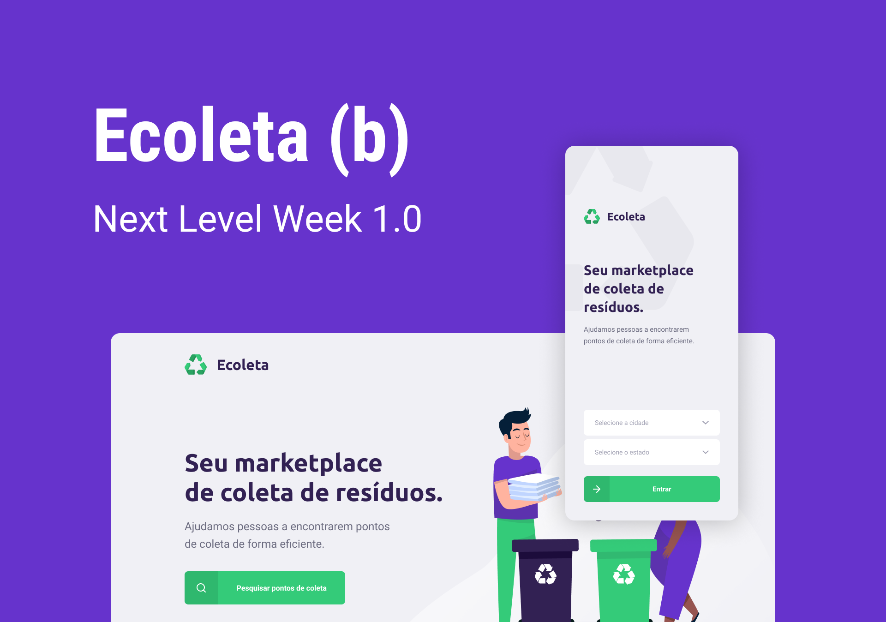
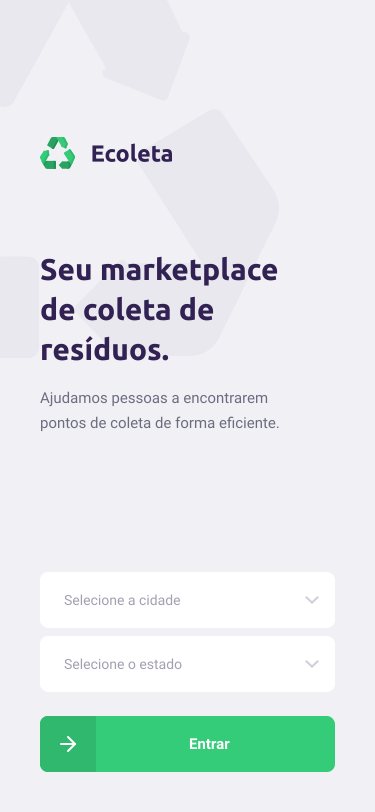
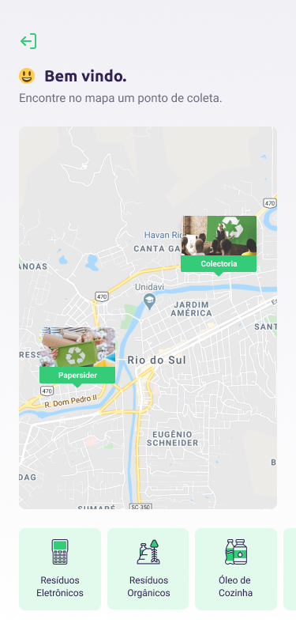

<h1 align="center">
  
</h1>
 <h4 align="center">
  NextLevelWeek 1.0
 </h4>
 
 <h2>
  O que é a Next Level Week?
 </h2>
 <p>
    NLW é evento pratico online com muito código e desafios,que tem o objetivo de te ajudar à
    alcançar o próximo passo na sua carreira como desenvolvedor.
 </p>.
 
 <h2>
  Projeto
 </h2>
 <p>
  O Ecoleta tem o objetivo de conectar pessoas a empresas que coletam resíduos específicos, como 
  lâmpadas, baterias, óleo de cozinha etc.
 </p>
 
 
 <h2>:rocket: Tecnologias </h2>
 <p>O projeto foi construído com as principais tecnologias abaixo:</p>
 <ul>
  <li>Node.js</li>
  <li>TypeScript</li>
  <li>React</li>
  <li>React Native</li>
  <li>Expo</li>
 </ul>
 
 <h2>Como usar :question:</h2>
 <p>Para clonar essa aplicação você irá precisar de Git, Node.Js e Yarn instalados em seu computador.</p>
 
 <h3>Instalando a API</h3>
 
 ```bash
 # Clone este repositório
 
 git clone https://github.com/ebertmota/Ecoleta.git
 
 # Navegue até o repositório
 $ cd Ecoleta/server
 
 # Instale as dependências
 $ yarn install
 
 # Rode as migrations
 $ yarn knex:migrate
 
 # Rode os seeds
 $ yarn knex:seed
 
 # Rodando o servidor
 & yarn dev
 
 # running on port 3333
 ```
 
 <h3>Instalando Frontend</h3>
 
 
  ```bash
 # Clone este repositório
 
 git clone https://github.com/ebertmota/Ecoleta.git
 
 # Navegue até o repositório
 $ cd Ecoleta/web
 
 # Instale as dependências
 $ yarn install
 
 # Rodando o projeto
 $ yarn start
 
 # running on port 3000
 ```
 
 <h3>Instalando Mobile</h3>

| | | |
|:-------------------------:|:-------------------------:|:-------------------------:|
|  |  ||

  ```bash
 # Clone este repositório
 
 git clone https://github.com/ebertmota/Ecoleta.git
 
 # Navegue até o repositório
 $ cd Ecoleta/mobile
 
 # Instale as dependências
 $ yarn install
 
 # Rodando o projeto
 $ yarn start
 
 # O Expo irá abrir em seu navegador agora é so escanear o qrcode e testar em seu celular.
 
 # Se você tiver algum problema com o expo, execute:
 $ expo install expo-font @expo-google-fonts/ubuntu @expo-google-fonts/roboto
 ```
 
 Made with :coffee: by <a href="https://www.linkedin.com/in/ebertmota/" >Ebert Mota</a>.
